  

  
  
  
  
  

---

## 🛡️ Applied AI & Agentic Reliability Proofs

Empirically benchmarked, crash-tested systems defending enterprise LLM deployments and autonomous agent workflows:

### 1. [PromptShield](https://github.com/builtbyhuy/ai-guard-gateway) — Enterprise LLM Security Proxy & Fallback Router
> **Problem:** OWASP LLM01 Prompt Injections (DAN jailbreaks, delimiter hijacking, role overrides) and expensive duplicate LLM API token consumption.
* **Architecture:** Real-time regex & heuristic threat scanner, in-memory token-bucket rate limiter, deterministic SHA-256 exact-match semantic cache (<1µs hits), and automated multi-provider circuit breaker failover.
* **Empirical Benchmark:** **1,641,261 scans/s** threat detection (0.4µs latency), **690,222 reads/s** cache throughput with 100% token cost elimination, **7/7 tests passing**.
* **Stack:** `TypeScript` · `Node.js` · `OWASP LLM01` · `Circuit Breaker`
* 🎮 **[Launch Interactive Security Radar ↗](https://builtbyhuy.github.io/ai-guard-gateway/)** &nbsp;|&nbsp; 📦 **[View Source Code ↗](https://github.com/builtbyhuy/ai-guard-gateway)**

---

### 2. [AgentToolGuard](https://github.com/builtbyhuy/agent-tool-guard) — AI Agent Tool-Call Firewall & Loop Interceptor
> **Problem:** Autonomous AI Agents (GPT-4o, Claude) executing hallucinated tool arguments, malicious parameter injections, and entering expensive infinite thrashing loops.
* **Architecture:** Deterministic parameter schema boundary validator, deep regex injection deflection, risk tiering (Tier 1 Read-Only to Tier 3 Critical requiring cryptographic authorization signatures), and sliding-window hash chain cycle detection.
* **Empirical Benchmark:** **102,516 evaluations/s** (5.33µs p50 latency), **435,640 injection attacks deflected/s**, **100% loop interception**, **10/10 tests passing**.
* **Stack:** `Python` · `FastAPI` · `Zod / Schema Boundary` · `Cycle Detection`
* 🎮 **[Interactive Browser Demo Available Locally]** &nbsp;|&nbsp; 📦 **[View Architecture & Specs ↗](https://github.com/builtbyhuy/agent-tool-guard)**

---

### 3. [Support Readiness AI Workbench](https://github.com/builtbyhuy/gorgias-wismo-returns-readiness-proof) — E-Commerce LLM Evaluator & Anti-Hallucination Harness
> **Problem:** Customer support AI agents hallucinating refund promises, mishandling dispute cases, and taking irreversible actions without verified order context.
* **Architecture:** Deterministic evaluation harness analyzing synthetic customer messages, routing routine tracking queries to review drafts while escalating dispute/chargeback risks to human staff.
* **Empirical Verification:** 15 synthetic evaluation scenarios, strict guardrails (zero unreviewed customer sends), **11/11 automated checks passing**.
* **Stack:** `Next.js` · `React` · `TypeScript` · `LLM Evaluation Harness`
* 🎮 **[Inspect Live Support Workbench ↗](https://builtbyhuy.github.io/gorgias-wismo-returns-readiness-proof/)** &nbsp;|&nbsp; 📦 **[View Source Code ↗](https://github.com/builtbyhuy/gorgias-wismo-returns-readiness-proof)**

---

## 🏛️ High-Throughput Distributed Systems

### 4. [HookSentinel](https://github.com/builtbyhuy/webhook-gateway) — Distributed Ingestion & Dead-Letter Broker
> **Problem:** High-volume webhook storms (Stripe, GitHub, Shopify) causing duplicate database writes, double-billing race conditions, and unhandled signature tampering.
* **Architecture:** Multi-provider constant-time HMAC-SHA256 verification, distributed idempotency locks (`provider:sha256(body)`), exponential backoff with jitter, and poisoned message Dead-Letter Queue (DLQ).
* **Empirical Benchmark:** **6,661 req/s** ingestion throughput (0.58ms p99 latency), **11,904 checks/s** replay suppression, **78/78 tests passing**.
* **Stack:** `FastAPI` · `Python` · `asyncio` · `SQLite WAL` · `Docker`
* 🎮 **[Launch Interactive Chaos Sandbox ↗](https://builtbyhuy.github.io/webhook-gateway/)** &nbsp;|&nbsp; 📦 **[View Source Code ↗](https://github.com/builtbyhuy/webhook-gateway)**

---

### 5. [CrashProofWAL](https://github.com/builtbyhuy/wal-kv-ledger) — Crash-Resilient Write-Ahead Log Store
> **Problem:** Storage corruption and bit rot caused by kernel panics, sudden power loss, or `SIGKILL` during high-throughput append workloads.
* **Architecture:** Compact binary block protocol, hardware CRC32 block checksums, automatic corrupted-tail truncation on startup, O(1) in-memory index, and SHA-256 Merkle tree state verification proofs.
* **Empirical Benchmark:** **847,449 writes/s (72.4 MB/s)**, **2.7M reads/s** index lookups, **15.03 ms surgical crash truncation** with 0 bytes committed data lost, **5/5 tests passing**.
* **Stack:** `Python` · `Binary Protocol` · `CRC32` · `Merkle Trees`
* 🎮 **[Launch Interactive Defrag & Recovery Cockpit ↗](https://builtbyhuy.github.io/wal-kv-ledger/)** &nbsp;|&nbsp; 📦 **[View Source Code ↗](https://github.com/builtbyhuy/wal-kv-ledger)**

---

### 6. [ResilientDAG](https://github.com/builtbyhuy/streamline-engine) — Fault-Tolerant DAG Pipeline Engine
> **Problem:** Long-running ETL data pipelines failing mid-flight requiring complete re-execution from scratch, wasting compute and API budgets.
* **Architecture:** Directed Acyclic Graph dependency solver using Kahn's algorithm, strict Zod runtime schema boundaries, parallel concurrency tiers, and durable disk checkpoints for zero-re-run crash recovery.
* **Empirical Benchmark:** **179,421 graphs/s** resolution (4.2µs p50), **115,767 checks/s** circular deadlock interception, **0% upstream compute loss on restart**, **10/10 tests passing**.
* **Stack:** `TypeScript` · `Node.js` · `Kahn DAG` · `Zod Validation`
* 🎮 **[Launch Interactive Pipeline Sandbox ↗](https://builtbyhuy.github.io/streamline-engine/)** &nbsp;|&nbsp; 📦 **[View Source Code ↗](https://github.com/builtbyhuy/streamline-engine)**

---

## 📊 Empirical Performance Matrix

| System | Domain | Primary Guarantee | Measured Throughput | Latency / SLA | Test Suite | Live Interactive Demo |
| :--- | :--- | :--- | :--- | :--- | :--- | :--- |
| **PromptShield** | Applied AI | OWASP LLM01 Jailbreak Defense | **1,641,261 scans/s** | 0.40µs scan | 7/7 Passing | [Launch Security Radar ↗](https://builtbyhuy.github.io/ai-guard-gateway/) |
| **AgentToolGuard** | Applied AI | Tool-Call Injection &amp; Loop Defense | **102,516 evals/s** | 5.33µs p50 | 10/10 Passing | [View Specs &amp; Harness ↗](https://github.com/builtbyhuy/agent-tool-guard) |
| **Support Readiness**| Applied AI | Anti-Hallucination Support Router | Grounded Decision | 100% Human Review | 11/11 Passing | [Inspect Workbench ↗](https://builtbyhuy.github.io/gorgias-wismo-returns-readiness-proof/) |
| **HookSentinel** | Systems | 100% Replay Lockout &amp; DLQ | **6,661 req/s** | 0.58ms p99 | 78/78 Passing | [Try Chaos Simulator ↗](https://builtbyhuy.github.io/webhook-gateway/) |
| **CrashProofWAL** | Storage | Bit-Rot Proof &amp; Append Durability | **847,449 writes/s** | 15.03ms recovery | 5/5 Passing | [Try Defrag Cockpit ↗](https://builtbyhuy.github.io/wal-kv-ledger/) |
| **ResilientDAG** | Systems | Zero Upstream Compute Loss | **179,421 graphs/s** | 4.20µs p50 | 10/10 Passing | [Try Pipeline Sandbox ↗](https://builtbyhuy.github.io/streamline-engine/) |

---

## 🎯 Verified Open Source Contribution

### [python-docx-ng](https://github.com/toxicphreAK/python-docx-ng/pull/131) — Quote-Safe XPath Bugfix `Merged Upstream`
* **Defect:** Word document style names containing single quotes caused XPath query crashes across document XML trees.
* **Resolution:** Replaced interpolated raw XPath strings with bound parameter lookups; engineered regression test suite covering quote-escaping edge cases. Independently reviewed and merged into upstream release.
* **Artifacts:** [Merged Upstream PR #131](https://github.com/toxicphreAK/python-docx-ng/pull/131) · [Reproduction Notes](notes/2026-09-06-xpath-variables.md)

---

## 💼 Commercial & Client Engineering

* **60-Second Lead Capture Engine:** Architected durable lead ingestion service (Node.js/Express, token-bucket rate limiting, Telegram webhook dispatch, write-ahead failover logging) delivering sub-minute response times and zero lead drop.
* **Automotive Workforce Attendance Platform:** Engineered operations web application for an automotive manufacturing facility in Vietnam, translating complex shift scheduling and punch-in rules into validated relational data models.
* **ERP Data Reconciliation Pipeline:** Automated ETL scripts extracting transaction records from Odoo ERP and spreadsheets into audited multi-format reports (Excel, HTML, PDF).
* **SkillArena Platform:** Full-stack interactive simulation platform built with Next.js, React, TypeScript, Supabase, strict Zod schemas, and Playwright E2E testing.

---

## 📬 Contact & Engagements

* **Location:** Ho Chi Minh City, Vietnam (Remote Worldwide · UTC+7)
* **Email:** [hohuyblon@gmail.com](mailto:hohuyblon@gmail.com)
* **LinkedIn:** [linkedin.com/in/builtbyhuy](https://www.linkedin.com/in/builtbyhuy/)
* **Executive CV:** [Download 1-Page Modern Executive CV (PDF)](https://github.com/builtbyhuy/builtbyhuy/raw/main/samples/Ho_Khac_Huy_Software_Engineer_CV.pdf)
