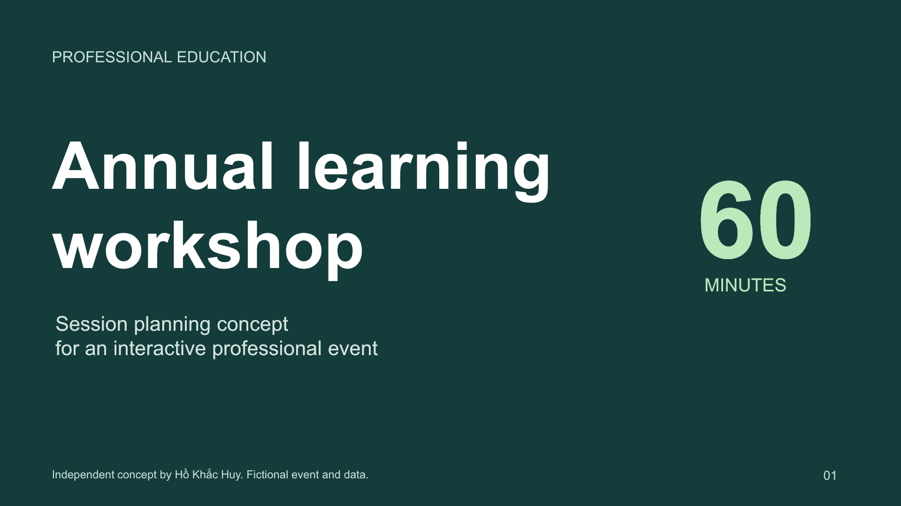
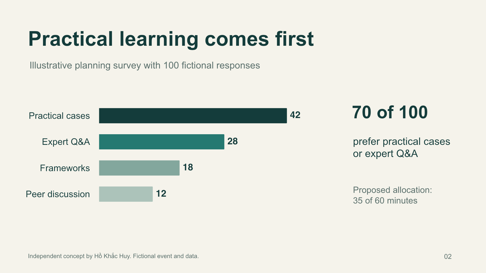
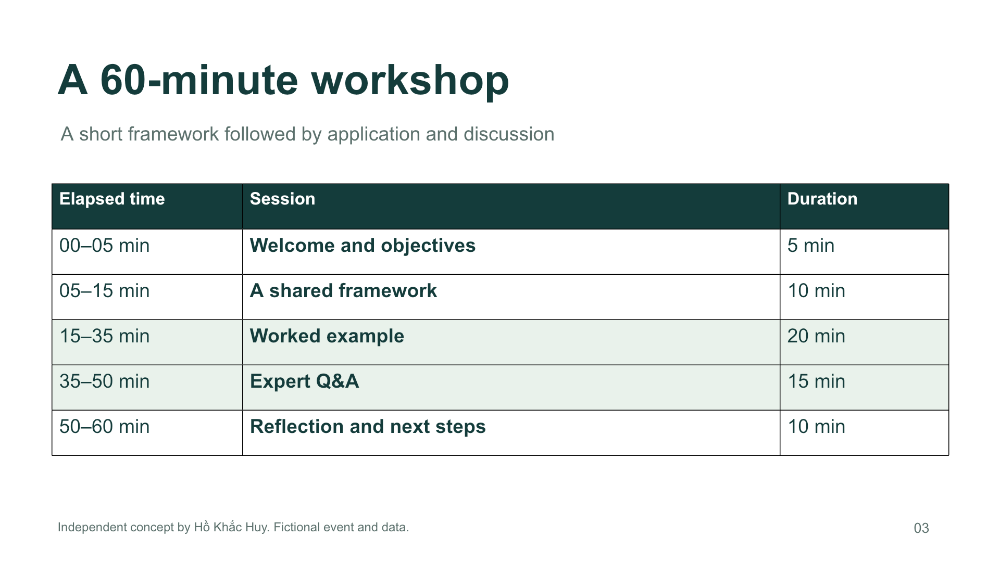

# Workshop presentation concept

**Hồ Khắc Huy · September 6, 2026**

A three-slide sample for a fictional professional-education workshop: an opening slide, a participant-priority chart, and a timed agenda. The design keeps the main message readable and connects the example survey to a proposed program.

[Download the PowerPoint file](workshop-concept.pptx)

The text, chart and table are native PowerPoint objects. The chart includes an embedded workbook with the four fictional values. The exported slides were visually reviewed, and the chart data, agenda arithmetic and file structure were checked. Opening and editing in desktop PowerPoint have not been tested.

## Opening

## Participant priorities

## Timed agenda

All event details and survey responses are invented for this independent sample. It is not client work, and no organization commissioned or endorsed it. Created with AI assistance.

For a scoped presentation or data-communication project, [email Huy](mailto:hohuyblon@gmail.com) with the audience, existing content and intended output.
